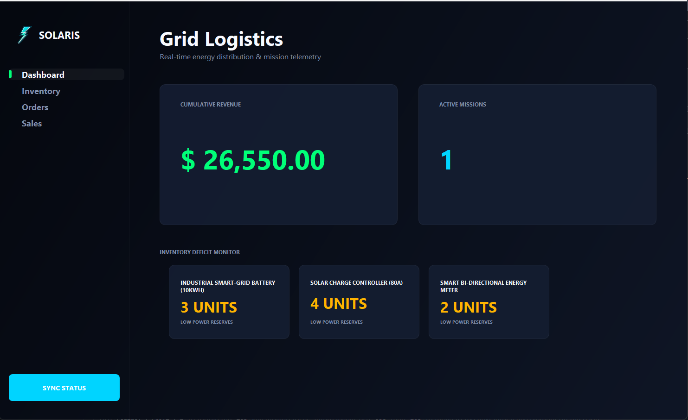

# SOLARIS // MISSION CONTROL GLOBAL
### Advanced Enterprise Energy Logistics & Deployment Suite

Solaris is a professional-grade business management dashboard designed for high-stakes energy infrastructure deployment. It combines complex algorithmic logic (DSA) with a "Crystalline" Glassmorphic UI to provide a surgical view of global operations.



## 🛠 Key Architecture
*   **Inventory Stack Engine**: Utilizes a `Stack`-based logic to monitor and prioritize critical asset deficits.
*   **Mission Dispatch Queue**: Implemented using a `LinkedList`-backed `Queue` for FIFO processing of hardware deployments.
*   **GlassPortal Modals**: Custom-engineered transparent dialog system to replace standard OS modals, ensuring visual consistency.
*   **Vector Rendering**: High-performance branding using `Graphics2D` and `Path2D` vector mathematics for zero-loss scaling.

## 🚀 Technical Stack
*   **Language**: Java 8+
*   **Framework**: Java Swing / AWT (Custom Graphics2D Implementation)
*   **Storage**: File-based persistence with synchronized integrity checks.
*   **Design Paradigm**: Glassmorphism / Elite Dark Mode

## 📈 Features
*   **Grid Operations**: Real-time revenue velocity tracking and mission telemetry.
*   **Hardware Vault**: Surgical asset management with dynamic Donut-Chart visualization.
*   **Dispatch Pipeline**: Live tracking of active deployments from initiation to execution.
*   **Financial Stream**: Historical performance analytics with high-precision Line-Chart plotting.

## 🔧 Installation
1. Clone the repository:
   ```bash
   git clone [YOUR_REPOSITORY_URL]
   ```
2. Compile and Run:
   ```bash
   javac -d bin src/*.java
   java -cp bin SolarisEnergyBackend
   ```

---
**Designed by Antigravity // Solaris Elite Design Standard 7.0**
